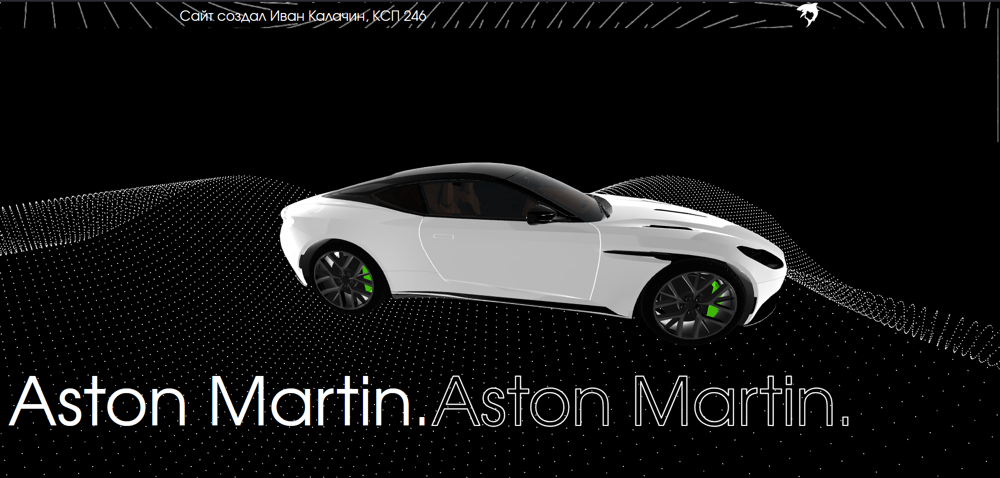
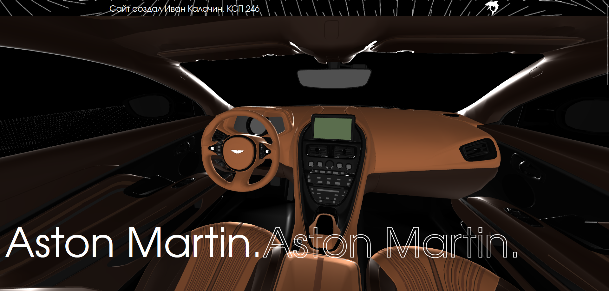

# Сайт про Aston Martin с 3дшками)))

**Стек:** `HTML5` | `CSS3` | `Vanilla JavaScript` | `Three.js`

## 🚀 О проекте

В данном проекте я просто баловался с библиотекой Three.js для 3D графики на сайте.

### Ключевые особенности реализации:
*   **Интерактивность:** вращения, приближения и других взаимодействий с моделью.
*   **Анимации:** Плавное вращение модельки.

## Фоточки

